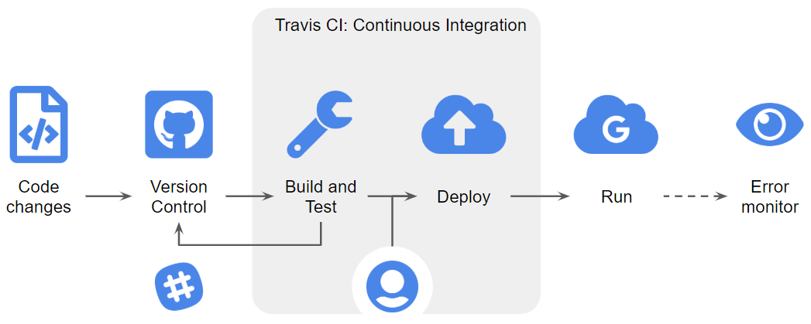
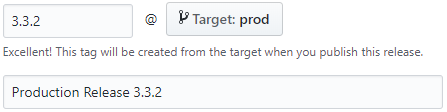

# The Frontend of MaveQuest

MaveQuest is an online database for querying literature-curated functional
assays, phenotypes and clinical interests of human genes for Multiplex Assays
of Variant Effect (MAVE) studies.

The frontend service of MaveQuest (**the Service**) is a Vue project that, once built, runs
on clients' browser.

The service receives requests from users, retrieve information from the
[MaveQuest API](https://api.mavequest.varianteffect.org) and parse and display
the information to users.

## Setup

### Checkout the code base and install dependencies

In order to run the Service, make sure that the source code and dependencies
are downloaded and installed properly.

```{bash}
# Check out source code
git checkout git@github.com:kvnkuang/mavequest-front-end.git
cd mavequest-front-end

# Install dependencies
npm install
```

### Compiles and hot-reloads for development

The Service uses [Vue-cli](https://cli.vuejs.org/) to run a demo server during
development. The demo server detects any changes you made to the source code
and provides a live preview.

**Do not use a demo server for production as the code is not optimized.**

In order to start the demo server, please run the following command.

```{bash}
npm run serve
```

### Compiles and minifies for production

The Service uses [Webpack](https://webpack.js.org/) to compile and create a
minimal, optimized code bundle for running in the production environment.

In order to build code for production, please run the following command.

```{bash}
npm run build
```

### Run your tests

The Service has implemented the ability for unit testing. A few sample test
cases have been written for `UnderConstructionView.vue`.

If you would like to add more test cases, please take a look at
[this document](https://vue-test-utils.vuejs.org/guides/testing-single-file-components-with-jest.html).

In order to run tests, please execute the following command.

**Please make sure all tests are passed before pushing code to Github.
You will not be able to merge code into `prod` branch with any errors.**

```{bash}
npm run test:unit
```

### Lints and fixes files

This Service uses [ESLint](https://github.com/vuejs/eslint-plugin-vue) to check
and fix syntax errors and violations of
[Vue.js Style Guide](https://vuejs.org/v2/style-guide/).

**Please make sure all problems detected by linting are fixed before pushing
code to Github. You will not be able to merge code into `prod` branch with
any linting problems.**

In order to lint your code, please run the following command.

```
npm run lint
```

## Push code

This Service uses a streamlined continuous integration and automatic deployment
pipeline for code quality and accountability.

This flowchart summarizes the pipeline.



### Push code to development branches

You are free to push code to any development branches. For example, `v2` was
the current active development branch at the time of writing this manual.
**However, you will not be able to push code directly into the production
branch (`prod`).**

This Service uses [Travis CI](https://travis-ci.com/), a contineous integration
system, to monitor all code changes in the Github repo. Any changes pushed to
the repo, no matter which branch it was pushed into, will be subject to Travis.
Travis will basically follow the **Setup** section above to inspect the codebase
for any errors. **Github will prevent any code from being merged into the
production branch (`prod`) if Travis detects any errors in it.**

If you are not familar with Git, you're highly recommendd to use a GUI
application (e.g. Github desktop) to handle all Git related requests.

Please follow [this instruction](https://help.github.com/en/desktop/contributing-to-projects/committing-and-reviewing-changes-to-your-project) to push code to a development
branch.

### Push code to the production branch `prod`

In short, you will not be able to push code directly into the `prod` branch.
Instead, you will have to push code to a development branch and request for a
**pull request**.

This design guarantees that all changes made to `prod` are intentional and have
passed all tests. Since `prod` branch hosts code that will run in the production
environment, we want to maintain the quality and stability of code in there.

#### Submit a Pull Request

Once you are happy with your code in a development branch, you can inititate
a pull request. Please take a look at [previous pull requests](https://github.com/kvnkuang/mavequest-front-end/pulls?q=is%3Apr+is%3Aclosed) and understand how they are
normally formatted.

If you are not sure about how to submit a pull request, please take a minute
to read [this document](https://help.github.com/en/articles/about-pull-requests).

You, or other contributors, can choose to accept or decline the pull request.
Once accepted, the code merges into the `prod` branch.

**Having code merged into the `prod` branch does not mean the code is running
on the production server.**
You need to create a new release to trigger a deployment.

#### Create a new release for deployment

I promise you this is the last step! Thanks for being patient.

Now, you have your code in `prod` branch. It's time to trigger a deployment.
Again, you will not be able to deploy code directly to the production server.
Travis will deploy your code for you.

However, you will need to trigger a deployment, letting Travis know that you
are ready for his service.

Please take a look at [previous releases](https://github.com/kvnkuang/mavequest-front-end/releases) and understand how they are normally formatted.

If you are not sure about how to create a release, please take a look at
[this document](https://help.github.com/en/articles/creating-releases).

**Make sure you create a tag name and set target to `prod` for each new release.
Releases without a tag name or didn't set target to `prod` will not trigger
an automatic deployment by Travis.**

Here is an example.



Congratulations! Your code is now on their way to the production server. Just
give it a couple minutes and refresh your browser to see the update.

Alternatively, you can go to [Travis CI](https://travis-ci.com/) and check the
status of the deployment (look for the build with a version tag).

## Monitor errors

This Service uses [Slack](https://slack.com) and [Sentry](https://sentry.io) to
monitor errors during the deploying and serving stages.

This manual will not go into details about how they are implemented.

If you are interested, please see the
[Error Monitoring and Reporting](docs/error-monitoring-and-reporting.md) guide.

## Contact me

Please feel free to [contact me](mailto:kvn.kuang@mail.utoronto.ca) if you still
have questions.

This manual was last updated on 2019-08-01.
